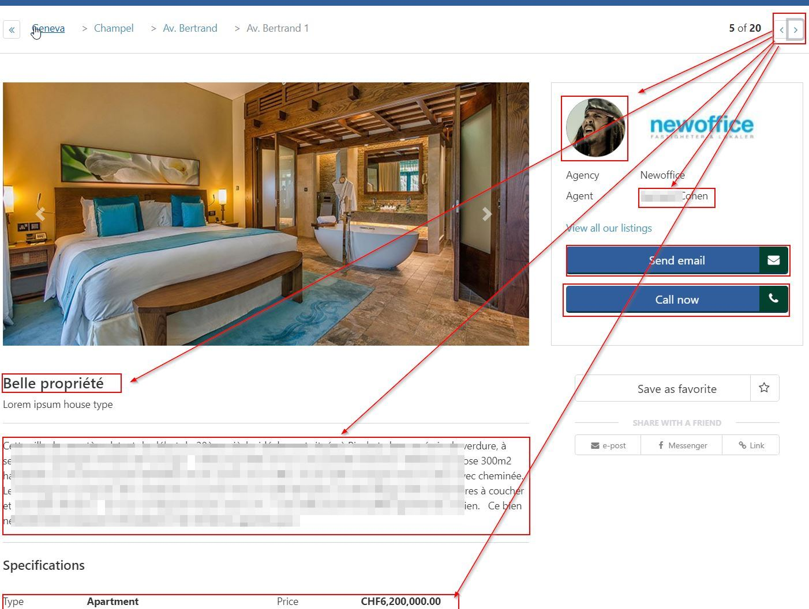

# Frontend test
The project is divided in 2 folders: **static** and **angular**.
* **static** holds the markup (html, css/scss, js)
* **angular** holds the angular 4 implementation of the markup

The **markup** can be previewed here: http://www.continut.org/test

The **angular** implementation, here: http://www.continut.org/test/angular/dist/

## _static_ folder

* Holds the markup, scss and js code of the template.
* Uses bootstrap v4beta as a css framework and fontawesome for the icons.
* index.html holds the main template, which is also responsive.

Once you have downloaded the git project:

1. `cd` into **static**.
2. Run `npm install` to install the required node modules. This installs bootstrap v4beta and fontawesome which are used by the template and grunt.
3. Once node modules are installed, execute `grunt` in the same **static** folder to automatically compile scss files into css while you change them.

Main scss file is _scss/app-ui.scss_ which uses some scss variables defined in __variables.scss_, the responsive media queries in __responsive.scss_ and the main overwrites of bootstrap in __main.css_

If the Google Map does not display, make sure to use a valid Google Maps Api key inside index.html

The final compiled css gets generated inside _css/app-ui.css_

## _angular_ folder

* Holds the angular implementation of the static files
* Uses the latest version of angular (v4.3.5)

In addition to **node** and **npm**, the node `ng` command needs to be installed in order for this to work. Make sure you run a `npm install -g @angular/cli` if it is not already present. 

How to run it in development mode:
1. `cd` into **angular**
2. Run `ng serve` to run angular then type in the browser the url displayed in the command line to view the application

How to run it in production mode:
1. `cd` into **angular**
2. Run `ng build --env=prod`. Once the build completes, your production files will be available inside _angular/dist_

Regarding the functionality, the app grabs all the estates from the json file and then displays them once you click on the **<** **>** (arrow) buttons at the right side of the breadcrumbs.

---

**Note:** If the json file is not fetched, update it's path to point to your local server in the file *angular/src/app/estate.service.ts*, the line that needs updating is `estatesJsonUrl: string = '/assets/json/properties.json';`

---

As requested, the only angular functionality available right now is changing the details of a listing.
This happens when you click the arrow buttons. We only modify so far the title, description, specifications, broker image and name, their email and phone number (the attributes on the 2 contact buttons)

